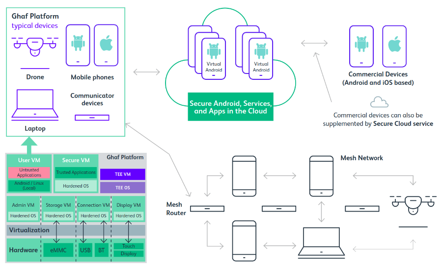

<!--
    Copyright 2022-2023 TII (SSRC) and the Ghaf contributors
    SPDX-License-Identifier: CC-BY-SA-4.0
-->

# About Ghaf

 Ghaf Framework is an open-source project that provides information about our work and studies in the security technologies field in the context of embedded virtualization. The applied software research supports _[Secure Systems Research Center](./appendices/glossary.md#ssrc) (SSRC)_ focus areas.

> The project code name Ghaf represents the [national tree of the UAE](https://www.ead.gov.ae/en/Discover-Our-Biodiversity/Plants/Ghaf-Tree).

*Ghaf Framework* can be used to build the *Ghaf Platform* that will provide an edge device software architecture with key features such as modularity and scalability through virtualization, support research and development of zero trust architecture (ZTA), and allow for low maintenance efforts while keeping the main code base stable and secure. The SSRC team focus is to research on enhancing ZTA to scale horizontally across edge HW platforms (phones, drones, laptops, communication modules) and vertically across SW platforms (Linux, Android, Browser, applications).

The Ghaf Platform is a baseline software platform for edge devices, utilizing a virtualized architecture for research and product development aiming to achieve the following core objectives: apply the general security principles of zero trust within the software architecture, and act as an enabler for ZTAs within organizations.

## Embedded Virtualization

Virtualization is one of the core enablers to transform the traditionally monolithic software stack within edge devices into isolated components with minimal TCB and clearly defined functionality.

The Ghaf Platform utilizes a collection of virtual machines (VMs) to define a system.

Contrary to the traditional monolithic OS, this concept allows to define and run host services in isolated environments, which breaks up the monolithic structure and allows for a modular system definition that is customizable for a specific use case. To this end, various applications and guest OSs can be deployed while simultaneously utilizing the Platform's features. 

## Ghaf Platform Applications

The Ghaf Platform development is focused on the transition to a modular architecture for edge devices. Products such as secure phones, drones, laptops, and other communication devices have unique challenges in their respective hardware and software ecosystems.

Enabling the integration of individual technology stacks into an organizational framework can be a challenging task. The Ghaf Platform is designed to ease this process and enable research to overcome a number of challenges.

## Design Principles

The design principles influencing the architecture of the Ghaf Platform are the following:

* Edge security  
  
    The Ghaf security architecture under development by SSRC aims to provide an understandable yet comprehensive view of security controls in the Platform so that vendors can make informed decisions and adopt the Platform for their use cases. The security architecture and subsequent research will be published by SSRC in a series of technical white papers. 

* Zero trust

    The Ghaf Platform aims to apply the general security principles of zero trust within the software architecture and to act as an enabler for ZTA for edge devices within organizations. 
  
* Trusted computing base 

    The general principle for establishing the trusted Ghaf Platform code base is to rely on audited software and proven security modules while carefully evaluating and integrating new concepts. The modularized platform not only simplifies the integration of additional security measures but also facilitates the integration of hardware security features. Leveraging and contributing to open-source projects is not only a cornerstone for the Platform components' maintainability but also for the toolchain to increase transparency and auditability. By providing a hardened code base for the hypervisor and OS for the various VMs in the architecture, the Ghaf Platform leverages security benefits across all modules.

* Configurable, declarative and reproducible

## Build System and Supply Chain

As software supply chain security becomes more and more relevant to product security, it is necessary to provide mechanisms to assert reproducible builds, with a transparent chain from source code over the build environment to the final binaries. Such a system allows faster analysis of not only software bugs but also security vulnerabilities and their impact on a product without the need for extensive analysis. This approach further reduces the efforts required for patching and allows mechanisms for safe fallbacks to secure states.

For more information on Ghaf supply chain security, see [Supply Chain Security](./scs/scs.md).
